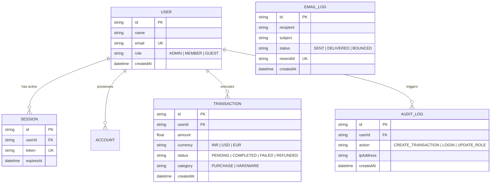
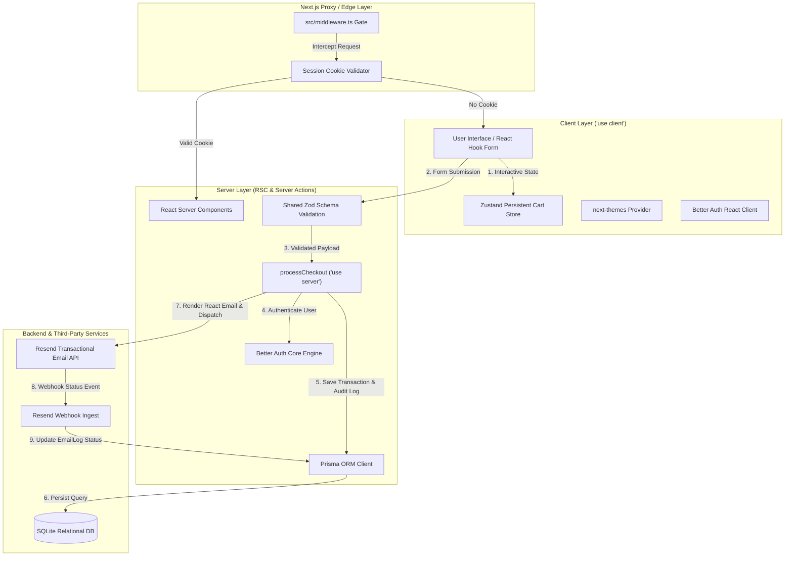

# Complete Project Structure & Unified System Architecture

**Course**: Full-Stack Development (FST) — Unified Full-Stack Application  
**Covered Assignments**: Assignment 1 & Assignment 2 (100% Integrated)  
**Target Course Outcomes**: 
- **CO1**: Next.js App Router compilation, Server vs Client component trees, and hydration boundary optimization.
- **CO2**: Full-stack architectures utilizing Server Actions for data mutations and secure backend state tracking.
- **CO3**: Secure authorization and multi-tenant session validation via Better Auth and Next.js Edge/Middleware proxy layers.
- **CO4**: Data-driven endpoints connecting relational platforms via Prisma ORM and automated Faker.js seeding.
**Covered Topics**: Topic 1 (shadcn/Radix Primitives), Topic 2 (Zustand State), Topic 3 (Zod Validation), Topic 4 (Faker.js Seeding), Topic 5 (Resend & React Email), Topic 6 (OG Images & Web Vitals Auditing).

---

## 1. Directory & File Structure Breakdown

```
assignment-1/
├── prisma/
│   ├── schema.prisma             # Multi-entity relational schema (User, Session, Transaction, AuditLog, EmailLog)
│   ├── seed.ts                   # Executable seeding script using @faker-js/faker
│   └── migrations/               # Database migration history
├── src/
│   ├── app/
│   │   ├── admin/
│   │   │   └── page.tsx          # Admin Control Panel (RBAC protected, stats & user table)
│   │   ├── api/
│   │   │   ├── admin/stats/      # GET /api/admin/stats (Admin-only statistics endpoint)
│   │   │   ├── auth/[...all]/    # Better Auth route handler (Sign-in, Sign-up, Sign-out, Session)
│   │   │   ├── og/               # GET /api/og (Dynamic OG image generation via @vercel/og)
│   │   │   ├── transactions/     # GET/POST /api/transactions (Protected mutation & audit logging)
│   │   │   └── webhooks/resend/  # POST /api/webhooks/resend (Email delivery & bounce webhook handler)
│   │   ├── checkout/
│   │   │   └── page.tsx          # Interactive checkout page with <Suspense> skeleton loader
│   │   ├── dashboard/
│   │   │   ├── page.tsx          # User dashboard (RSC session validation & transaction metrics)
│   │   │   └── sign-out-button.tsx # Client component for session termination
│   │   ├── login/
│   │   │   └── page.tsx          # Better Auth sign-in client form with seed credentials display
│   │   ├── register/
│   │   │   └── page.tsx          # Better Auth sign-up client form
│   │   ├── unauthorized/
│   │   │   └── page.tsx          # Access Denied page for insufficient RBAC roles
│   │   ├── actions.ts            # Type-safe Server Action ('use server') handling Zod mutations & DB persistence
│   │   ├── globals.css           # Global CSS design tokens & Tailwind utilities
│   │   ├── layout.tsx            # Root layout wrapping ThemeProvider & WebVitalsReporter
│   │   └── page.tsx              # RSC Home Page fetching live database statistics
│   ├── components/
│   │   ├── cart-sidebar.tsx      # Zustand cart drawer with localized INR calculations
│   │   ├── checkout-form.tsx    # Accessible react-hook-form + Zod client validation
│   │   ├── header.tsx            # Sticky header with theme toggle, auth links & live cart count badge
│   │   ├── product-card.tsx      # Hydration boundary leaf component with optimistic cart triggers
│   │   ├── theme-provider.tsx    # next-themes wrapper with zero-CLS configuration
│   │   ├── theme-toggle.tsx      # Dark/light/system theme selector
│   │   ├── web-vitals-reporter.tsx # Core Web Vitals telemetry auditor (LCP, CLS, INP, FCP, TTFB)
│   │   └── ui/                   # Radix / shadcn UI primitives (button, card, input, label, skeleton)
│   ├── emails/
│   │   ├── welcome.tsx           # React Email template for new user onboardings
│   │   └── transaction-alert.tsx # React Email template for order & transaction confirmations
│   ├── lib/
│   │   ├── auth.ts               # Better Auth engine configuration with Prisma SQLite adapter
│   │   ├── auth-client.ts        # Better Auth React client SDK (signIn, signUp, signOut)
│   │   ├── email.ts              # Resend API integration helper with HTML template rendering
│   │   ├── prisma.ts             # Global singleton Prisma Client instance
│   │   ├── products.ts           # Product catalog dataset with INR formatting
│   │   ├── schemas.ts            # Shared Zod validation schema (checkoutSchema)
│   │   └── utils.ts              # Tailwind merge utility (`cn`)
│   ├── store/
│   │   └── useCartStore.ts       # Zustand client store with localStorage persistence
│   └── middleware.ts             # Edge Proxy Middleware enforcing session cookie & RBAC gates
├── TECHNICAL_REPORT.md           # 2-3 page Technical Report analyzing RSC vs Client, Zustand, & Web Vitals
├── STRUCTURE_ARCHITECTURE.md     # Full architectural documentation & flow diagrams
├── package.json                  # Dependencies & DB pipeline commands (`db:setup`, `db:seed`, etc.)
└── .env                          # Local environment variables
```

---

## 2. Multi-Entity Relational Data Model (Prisma ORM)



---

## 3. End-to-End Component & Data Flow Architecture



---

## 4. Requirement Coverage Verification Matrix

| Requirement Source | Feature Description | Implementation Location | Verified Status |
| :--- | :--- | :--- | :--- |
| **Assignment 1 — Part A** | App Router, Tailwind CSS, Radix/shadcn primitives | `src/components/ui/`, `src/app/` | ✅ Complete |
| **Assignment 1 — Part A** | Client theme switching (`next-themes`) & hydration protection | `src/components/theme-provider.tsx`, `src/app/layout.tsx` | ✅ Complete |
| **Assignment 1 — Part A** | RSC vs Client Component boundary analysis & prop serialization | `src/app/page.tsx`, `TECHNICAL_REPORT.md` | ✅ Complete |
| **Assignment 1 — Part B** | Persistent Zustand cart store avoiding re-renders across layouts | `src/store/useCartStore.ts`, `src/components/cart-sidebar.tsx` | ✅ Complete |
| **Assignment 1 — Part C** | Type-safe form mutations with `react-hook-form` + `Zod` + Server Actions | `src/components/checkout-form.tsx`, `src/app/actions.ts` | ✅ Complete |
| **Assignment 1 — Part C** | `<Suspense>` loading skeletons & optimistic UI / error feedback | `src/app/checkout/page.tsx`, `src/components/checkout-form.tsx` | ✅ Complete |
| **Assignment 1 — Topic 6** | Dynamic OG Images & Core Web Vitals Auditing | `src/app/api/og/route.ts`, `src/components/web-vitals-reporter.tsx` | ✅ Complete |
| **Assignment 2 — Part A** | Multi-entity relational schema in Prisma ORM | `prisma/schema.prisma` | ✅ Complete |
| **Assignment 2 — Part A** | Automated seeding script with `@faker-js/faker` | `prisma/seed.ts` (15 users, 77 transactions, 104 audit logs) | ✅ Complete |
| **Assignment 2 — Part A** | CLI pipeline commands (`db:setup`, `db:migrate`, `db:seed`) | `package.json` | ✅ Complete |
| **Assignment 2 — Part B** | Authenticated session enforcement & protected API routes | `src/app/api/transactions/route.ts`, `src/app/api/admin/stats/route.ts` | ✅ Complete |
| **Assignment 2 — Part B** | Next.js Proxy/Middleware role-based access control (Admin/Member/Guest) | `src/middleware.ts`, `src/app/admin/page.tsx` | ✅ Complete |
| **Assignment 2 — Part C** | Transactional emails via Resend API & React Email templates | `src/lib/email.ts`, `src/emails/welcome.tsx`, `src/emails/transaction-alert.tsx` | ✅ Complete |
| **Assignment 2 — Part C** | Resend Webhook Handler logging delivery & bounce events in DB | `src/app/api/webhooks/resend/route.ts` | ✅ Complete |

---

## 5. Summary of Automated Commands

```bash
# 1. Start Development Server
npm run dev

# 2. Run Database Setup (Reset DB, Apply Migrations, Run Faker Seed)
npm run db:setup

# 3. Open Prisma Studio Database Viewer
npm run db:studio

# 4. Production Build Verification
npm run build
```
